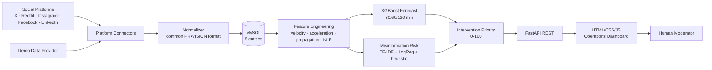

# PR•VISION — Architecture

## System Overview



## Layered Design

```
frontend/                 vanilla HTML5/CSS3/JS (zero build step)
    index.html            single-page operations dashboard
    css/                  design tokens, layout, responsive
    js/                   api · utils · charts · posts · alerts · dashboard
backend/
    app/main.py           app factory, lifespan, static serving, CORS
    app/api/routes/       health, platforms, posts, predictions, dashboard,
                          ingestion, ml — thin HTTP layer only
    app/core/             settings (pydantic-settings), logging w/ secret redaction
    app/db/
        database.py       engine factory (MySQL primary / SQLite fallback), pooling
        models/           8 ORM entities with FKs, unique + composite indexes
        repositories/     all queries; pagination, aggregates, batch inserts
    app/schemas/          pydantic request/response contracts
    app/services/         ingestion · feature · prediction · scoring · demo
    app/connectors/       base interface + per-platform adapters + normalizer
    app/ml/               feature_engineering · forecasting · misinformation
                          training · inference · evaluation
    alembic/              migrations (single chain for MySQL and SQLite)
ml/models/                versioned artifacts + registry.json
scripts/                  seed_demo_data.py · train_models.py
```

## Data Flow (per metric snapshot)

1. **Ingestion** — `IngestionScheduler` runs an isolated asyncio loop per platform
   (`fetch_post_metrics` → normalized payload). Failures retry with exponential
   backoff and update `data_source_status`; one platform never blocks another.
2. **Persistence** — raw metrics land in `metric_snapshots` (post_id + timestamp
   unique) and reshare edges in `propagation_events`. Counters are cumulative;
   missing platform metrics are stored as NULL, never 0.
3. **Feature engineering** — `build_feature_vector()` is a pure function over
   snapshot history ≤ t (strict causality). Rows persist in `feature_snapshots`
   for training reuse and auditability.
4. **Prediction** — `ModelManager` (singleton, models warm in memory) forecasts
   additional shares per horizon. Cold start (< 3 snapshots or no artifact)
   falls back to the transparent velocity baseline with low confidence.
5. **Scoring** — `spread_risk` (soft-OR of squashed forecast/velocity/sharer
   signals) and `misinformation_risk` (0.65 model + 0.35 heuristic) combine via
   configurable weights into the 0–100 Intervention Priority Score, stored with
   an explanation built only from observed features.
6. **Serving** — the dashboard polls `/api/dashboard/*` every ~8 s; all KPI
   values, charts, and the priority queue are computed from live DB data.

## Database Schema

| Table | Purpose | Key indexes |
|-------|---------|-------------|
| `posts` | normalized post identity + content | unique(platform, external_post_id), (platform, posted_at) |
| `metric_snapshots` | raw metrics over time (analysis atom) | unique(post_id, timestamp) |
| `propagation_events` | reshare cascade edges (where exposed) | (post_id, timestamp), (post_id, depth) |
| `feature_snapshots` | causal engineered features at t | unique(post_id, timestamp) |
| `predictions` | per-horizon forecasts + model version | (post_id, prediction_timestamp, horizon) |
| `misinformation_scores` | risk 0–1 + label + model version | (post_id, timestamp) |
| `intervention_scores` | spread, misinfo, priority 0–100, explanation | (post_id, timestamp), priority |
| `data_source_status` | per-connector health, fetch/error counters | unique(platform) |

## Realtime Strategy

Polling was chosen deliberately over SSE/WebSocket (spec #36: simplest reliable
approach): the dashboard re-fetches aggregates every 8 s and pauses when the
tab is hidden. The backend ingestion scheduler polls platforms on a
configurable interval (default 30 s) with per-platform failure isolation.

## Decision-Support Ethics

PR•VISION forecasts *spread* and estimates *misinformation risk*; it never
issues truth verdicts, automated takedowns, or bans. Every score ships with
evidence-based explanations for human review.
